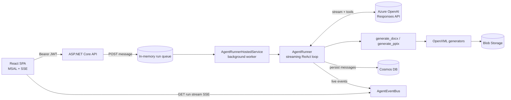

# MnaiWork

A chat-based agent that turns a request into a polished **Word document (.docx)** or
**PowerPoint deck (.pptx)** — no sandbox, no headless browser. The model plans the content and
the C# backend renders it directly with the Open XML SDK.

- **Backend:** ASP.NET Core (.NET 8), Azure OpenAI **Responses API** (streaming), Azure **Cosmos DB**,
  Azure **Blob Storage**, Entra ID (AAD) auth.
- **Frontend:** React + Vite + TypeScript, MSAL, streaming chat over SSE.
- **Document generation:** pure C# via `DocumentFormat.OpenXml` with a set of curated themes and slide
  layouts — a much simpler path than rendering HTML in a sandbox.

> Inspired by the Societas architecture (start/consume decoupling, tool-calling agent, artifact
> preview) but re-implemented from scratch in C#/React with a sandbox-free generation pipeline.

---

## Architecture



**Flow:** the client posts a message → the API stores it in Cosmos, creates a run, and returns a
`runId` immediately. A background service picks up the run, streams the model response, invokes tools,
persists every message, and publishes live events. The client consumes those events over an SSE long
connection and reconciles with the persisted messages when the run completes.

---

## Prerequisites

- **.NET SDK 8** (`backend/global.json` pins `8.0.x`).
- **Node.js 18+** and npm (for the frontend).
- Azure resources:
  - **Azure OpenAI / AI Foundry** deployment that supports the Responses API (e.g. `gpt-5.1`).
  - **Azure Cosmos DB** (NoSQL) account (or the local Cosmos emulator).
  - **Azure Storage** account (Blob).
  - *(Optional)* **Entra ID** app registrations for the SPA and API.

---

## Backend

### 1. Configure

Secrets are read from user-secrets / environment / `appsettings.json`. The Azure OpenAI credentials are
already stored in user-secrets on this machine. Set the rest:

```powershell
cd backend/src/MnaiWork.Api

# Azure OpenAI (already set here; shown for reference)
dotnet user-secrets set "AzureOpenAI:Endpoint"   "https://<resource>.services.ai.azure.com/openai/v1"
dotnet user-secrets set "AzureOpenAI:Deployment" "gpt-5.1"
dotnet user-secrets set "AzureOpenAI:ApiKey"     "<key>"

# Cosmos DB (use the account key, or leave Key empty to use Entra ID / DefaultAzureCredential)
dotnet user-secrets set "Cosmos:Endpoint" "https://<account>.documents.azure.com:443/"
dotnet user-secrets set "Cosmos:Key"      "<cosmos-key>"

# Blob Storage (connection string, or set Storage:ServiceUri + use Entra ID)
dotnet user-secrets set "Storage:ConnectionString" "<blob-connection-string>"
```

Non-secret defaults (database/container names, CORS origins, TTLs) live in
[appsettings.json](backend/src/MnaiWork.Api/appsettings.json). The database and containers are created
automatically on first run.

**Auth:** if `AzureAd:ClientId` is empty the API runs in **local dev mode** — a dev authentication
handler authenticates every request (the SPA sends an `X-Debug-User` header). Set the `AzureAd` section
to require real Entra ID tokens.

### 2. Run

```powershell
cd backend/src/MnaiWork.Api
dotnet run
```

The API listens on `http://localhost:5124` with Swagger at `/swagger`.

---

## Frontend

```powershell
cd frontend
npm install
copy .env.example .env.local   # optional; defaults work with the dev proxy
npm run dev
```

Open `http://localhost:5173`. The Vite dev server proxies `/api` to the backend. With no
`VITE_AAD_CLIENT_ID` set, the app runs in dev mode (no login). Provide the `VITE_AAD_*` values to enable
MSAL sign-in.

---

## How generation works (the "simpler beautiful PPT" approach)

Instead of asking the model for raw HTML and rendering it in a browser sandbox, the tools expose a
**structured JSON contract**:

- `generate_pptx` → a `DeckSpec` (title, theme, and slides with layouts: `title`, `section`, `bullets`,
  `two-column`, `quote`, `closing`).
- `generate_docx` → a `DocSpec` (title, theme, and blocks: headings, paragraphs, bullet/numbered lists,
  quotes, tables, dividers).

The C# generators ([PptxGenerator](backend/src/MnaiWork.Api/Generation/PptxGenerator.cs),
[DocxGenerator](backend/src/MnaiWork.Api/Generation/DocxGenerator.cs)) render these specs into
well-designed, themed Office files using five built-in themes (`midnight`, `azure`, `sunset`, `forest`,
`mono`). Files are uploaded to Blob Storage and returned as download cards in the chat.

---

## Project structure

```
backend/
  MnaiWork.sln
  src/MnaiWork.Api/
    Agent/            # AgentRunner (ReAct loop), event bus, run queue, hosted service, tools
    Controllers/      # threads/messages, SSE run stream, file download
    Data/             # Cosmos context + repositories (System.Text.Json serializer)
    Generation/       # DeckSpec/DocSpec + PPTX/DOCX OpenXML generators + themes
    Storage/          # Blob storage + SAS download links
    Infrastructure/   # current-user, dev auth handler, JSON defaults
    Configuration/    # options
  tools/
    GenCheck/         # dev: validates generated files against the OpenXML schema
    OpenAiSmoke/      # dev: validates streaming + function calling against the endpoint
frontend/
  src/
    api/              # typed client + SSE consumer
    auth/             # MSAL wrapper (dev-mode aware)
    store/            # zustand chat store (streaming orchestration)
    components/       # sidebar, chat view, message list, composer, artifact card
```

## Dev utilities

```powershell
# Validate the OpenXML output (writes sample.pptx / sample.docx, prints validation issues)
dotnet run --project backend/tools/GenCheck -c Release

# Smoke-test streaming + function calling against the configured endpoint
dotnet run --project backend/tools/OpenAiSmoke
```

## Security notes

- Secrets are kept in user-secrets / environment variables, never in `appsettings.json`.
- The dev auth handler is for local development only. In production, configure `AzureAd` so the API
  validates real Entra ID tokens.
- Download links are short-lived SAS URLs; if SAS cannot be minted the API falls back to an
  authenticated proxy route.
- This is a single-instance design (in-memory run queue + event bus). To scale horizontally, replace
  them with a durable queue and Redis pub/sub.
