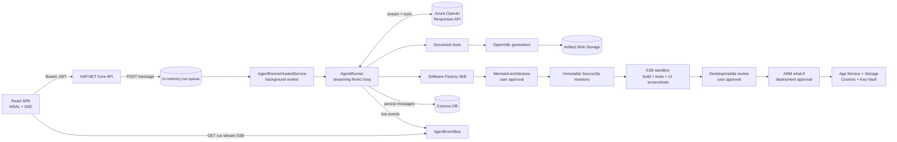

# MnaiWork

A chat-based agent with two controlled production paths:

- Create polished **Word documents (.docx)** and **PowerPoint decks (.pptx)** with Open XML.
- Design, implement, test, review, and deploy **React + ASP.NET Core** applications through a
  server-side software-factory Skill, project-scoped E2B sandboxes, and reviewed Azure ARM templates.

- **Backend:** ASP.NET Core (.NET 8), Azure OpenAI **Responses API** (streaming), Azure **Cosmos DB**,
  Azure **Blob Storage**, Entra ID (AAD) auth.
- **Frontend:** React + Vite + TypeScript, MSAL, streaming chat over SSE.
- **Document generation:** pure C# via `DocumentFormat.OpenXml` with a set of curated themes and slide
  layouts.
- **Software factory:** immutable source revisions, xUnit/Vitest/Playwright, E2B desktop/mobile UI
  screenshots, managed identity, ARM what-if, explicit approvals, and idempotent Azure publication.

> Inspired by the Societas start/consume separation, server-side Skills, and sandbox artifact flow,
> but implemented for this repository's fixed C#/React and Azure security boundaries.

---

## Architecture



The client posts a message, the API stores it in Cosmos and queues a run, and the background agent
streams text/tools over SSE. For software projects, the exact approved Mermaid architecture is kept
in later LLM context and acts as the implementation contract.

---

## Prerequisites

- **.NET SDK 8** (`backend/global.json` pins `8.0.x`).
- **Node.js 18+** and npm (for the frontend).
- **Docker Desktop** and an **E2B** account for the custom sandbox template.
- Azure resources:
  - **Azure OpenAI / AI Foundry** deployment that supports the Responses API (e.g. `gpt-5.1`).
  - **Azure Cosmos DB** (NoSQL) account (or the local Cosmos emulator).
  - **Azure Storage** account (Blob).
  - **Azure Key Vault** for Agent secrets, including `E2B--ApiKey` and `E2B--TemplateId`.
  - *(Optional)* **Entra ID** app registrations for the SPA and API.

---

## Backend

### 1. Configure

Secrets are read from user-secrets / environment / `appsettings.json`. The Azure OpenAI credentials are
already stored in user-secrets on this machine. Set the rest:

```powershell
cd backend/src/MnaiWork.Api

# Azure OpenAI (already set here; shown for reference)
dotnet user-secrets set "AzureOpenAI:Endpoint"   "https://<resource>.services.ai.azure.com/openai/v1"
dotnet user-secrets set "AzureOpenAI:Deployment" "gpt-5.1"
dotnet user-secrets set "AzureOpenAI:ApiKey"     "<key>"

# Cosmos DB (use the account key, or leave Key empty to use Entra ID / DefaultAzureCredential)
dotnet user-secrets set "Cosmos:Endpoint" "https://<account>.documents.azure.com:443/"
dotnet user-secrets set "Cosmos:Key"      "<cosmos-key>"

# Blob Storage (connection string, or set Storage:ServiceUri + use Entra ID)
dotnet user-secrets set "Storage:ConnectionString" "<blob-connection-string>"
```

Non-secret defaults (database/container names, CORS origins, TTLs) live in
[appsettings.json](backend/src/MnaiWork.Api/appsettings.json). The database and containers are created
automatically on first run.

**Auth:** if `AzureAd:ClientId` is empty the API runs in **local dev mode** — a dev authentication
handler authenticates every request (the SPA sends an `X-Debug-User` header). Set the `AzureAd` section
to require real Entra ID tokens.

### 2. Run

```powershell
cd backend/src/MnaiWork.Api
dotnet run
```

The API listens on `http://localhost:5124` with Swagger at `/swagger`.

---

## Frontend

```powershell
cd frontend
npm install
npm run dev
```

Open `http://localhost:5173`. The Vite dev server proxies `/api` to the backend. Development uses the
same tenant-restricted Entra login as production; the SPA app registration must include
`http://localhost:5173` as a Single-page application redirect URI. The tenant is configured in
`frontend/.env.development`.

---

## Software factory workflow

1. The Agent turns the idea into acceptance criteria and a rendered Mermaid architecture diagram.
2. The user reviews it and sends exactly `APPROVE ARCHITECTURE`.
3. The Agent creates or resumes an immutable SourceZip revision and implements against the approved
  architecture. The latest Mermaid message is pinned into LLM context during long-conversation compaction.
4. E2B runs .NET restore/build/unit/integration tests and npm/Vitest/Vite, then starts the generated
  API and Vite preview together for Playwright E2E and desktop/mobile UI capture. The screenshots
  appear inline in chat.
5. The user requests UI changes or sends exactly `APPROVE UI`.
6. The Agent runs ARM what-if. Deployment requires a later exact `DEPLOY <projectSlug>` message.
7. Azure receives only tested packages. Deployment injects the API URL through `runtime-config.js`;
  generated backends use `DefaultAzureCredential` for Storage, Cosmos, and Key Vault through the App
  Service system-assigned managed identity. Deployment verifies a package fingerprint plus Blob,
  Cosmos, and Key Vault readiness before reporting success.

### Existing project iteration

Projects can be modified or extended in the **same conversation thread**. The Skill calls
`list_my_files`, selects the newest matching SourceZip, renders a revised architecture, and repeats all
architecture/UI/deployment approvals. Reusing the same slug incrementally updates deterministic Azure
resources and publishes newly tested packages. Cross-thread recovery is not currently supported because
there is no long-lived Project/Revision repository outside conversation artifacts.

The E2B template lives in [backend/sandbox/e2bdocker](backend/sandbox/e2bdocker/README.md). Azure setup,
the Cosmos deployment profile, identity roles, and publication details are documented in
[infra/README.md](infra/README.md).

---

## How document generation works

Instead of asking the model for raw HTML and rendering it in a browser sandbox, the tools expose a
**structured JSON contract**:

- `generate_pptx` → a `DeckSpec` (title, theme, and slides with layouts: `title`, `section`, `bullets`,
  `two-column`, `quote`, `closing`).
- `generate_docx` → a `DocSpec` (title, theme, and blocks: headings, paragraphs, bullet/numbered lists,
  quotes, tables, dividers).

The C# generators ([PptxGenerator](backend/src/MnaiWork.Api/Generation/PptxGenerator.cs),
[DocxGenerator](backend/src/MnaiWork.Api/Generation/DocxGenerator.cs)) render these specs into
well-designed, themed Office files using five built-in themes (`midnight`, `azure`, `sunset`, `forest`,
`mono`). Files are uploaded to Blob Storage and returned as download cards in the chat.

---

## Project structure

```
backend/
  MnaiWork.sln
  src/MnaiWork.Api/
    Agent/            # AgentRunner (ReAct loop), event bus, run queue, hosted service, tools
    Controllers/      # threads/messages, SSE run stream, file download
    Data/             # Cosmos context + repositories (System.Text.Json serializer)
    Generation/       # DeckSpec/DocSpec + PPTX/DOCX OpenXML generators + themes
    Storage/          # Blob storage + SAS download links
    Infrastructure/   # current-user, dev auth handler, JSON defaults
    Configuration/    # options
  src/MnaiWork.BuildWorker/ # fixed build/test/UI screenshot pipeline
  src/MnaiWork.E2BRunner/   # sandbox HTTP runner
  sandbox/e2bdocker/        # E2B template and local verification
  tools/
    GenCheck/         # dev: validates generated files against the OpenXML schema
    OpenAiSmoke/      # dev: validates streaming + function calling against the endpoint
infra/
  bootstrap/          # optional least-privilege Agent role setup
  generated-project/  # reviewed generated-app ARM/Bicep template
frontend/
  src/
    api/              # typed client + SSE consumer
    auth/             # MSAL wrapper (dev-mode aware)
    store/            # zustand chat store (streaming orchestration)
    components/       # sidebar, chat view, message list, composer, artifact card
```

## Dev utilities

```powershell
# Validate the OpenXML output (writes sample.pptx / sample.docx, prints validation issues)
dotnet run --project backend/tools/GenCheck -c Release

# Smoke-test streaming + function calling against the configured endpoint
dotnet run --project backend/tools/OpenAiSmoke
```

## Security notes

- Secrets are kept in user-secrets / environment variables, never in `appsettings.json`.
- E2B API key and template ID are read from Key Vault and are never sent into a sandbox.
- Generated applications use endpoint settings plus `DefaultAzureCredential`; Storage shared-key auth
  and Cosmos local auth are disabled by ARM.
- Project repair builds reuse an isolated E2B sandbox briefly for warm dependency caches; each build
  uses a clean workspace and receives no Agent Azure/Cosmos/Key Vault credentials.
- The dev auth handler is for local development only. In production, configure `AzureAd` so the API
  validates real Entra ID tokens.
- Download links are short-lived SAS URLs; if SAS cannot be minted the API falls back to an
  authenticated proxy route.
- This is a single-instance design (in-memory run queue + event bus). To scale horizontally, replace
  them with a durable queue and Redis pub/sub.
