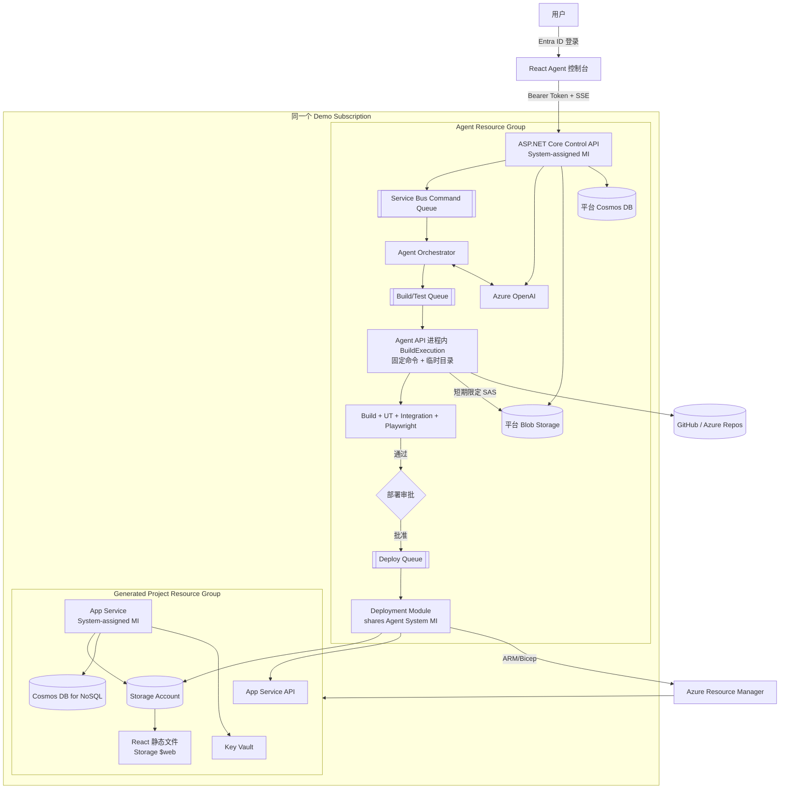
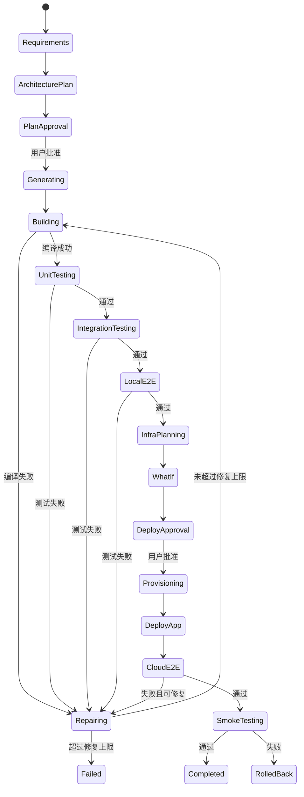

# AI 软件工厂 Agent 设计文档

## 1. 文档信息

| 项目 | 内容 |
| --- | --- |
| 状态 | Draft |
| 日期 | 2026-08-18 |
| 基础项目 | MnaiWork |
| 默认技术栈 | React + TypeScript + ASP.NET Core .NET 8 |
| 默认云平台 | Microsoft Azure |
| 租户范围 | 单一 Microsoft Entra Tenant |
| Demo 部署范围 | 单一 Subscription、Agent/Generated 两个 Resource Group |

## 2. 背景

MnaiWork 当前已经具备 Azure OpenAI 工具调用、Cosmos DB 状态存储、Blob Storage 产物存储、Microsoft Entra ID 登录和后台 Agent 执行能力。本设计在此基础上扩展一个“AI 软件工厂 Agent”：用户输入业务需求后，Agent 自动完成需求分析、项目规划、前后端代码生成、单元测试、集成测试、端到端测试、基础设施规划和 Azure 部署。

本系统不是允许大模型直接控制 Azure 或执行任意 Shell 的聊天机器人。它是一个由状态机、受控工具、隔离执行环境、测试门禁和人工审批组成的软件交付平台。

软件工厂新增的 AzureProvisioning、BuildExecution 与 Azure AD tenant 设置保存在 Cosmos
`deploymentProfiles/default` 中，通过认证 API 供用户查看和编辑，并通过只读 Tool 提供给 Agent。
Key Vault 继续保存 Cosmos/OpenAI/Storage 凭据等秘密，不迁移其他 Agent 运行配置。
该 profile 不从 Key Vault 或 App Configuration 自动迁移；首次部署前由用户在 Cosmos Data
Explorer 中创建。缺少 profile 时 API 明确拒绝启动并提示创建该 item。

### 2.1 当前实现状态

当前代码完成了 Azure provisioning 纵向切片、Societas 风格 server-side Skill 基础层，以及
Agent API 进程内构建 MVP：不可变源码 ZIP 工作区、受控代码读写 Tool、固定
restore/build/UT/Integration/Vitest/Playwright/publish 流水线、构建报告与后端/前端发布包。

以下设计仍待实现：Git revision、`lastKnownGood` 自动回滚、部署后的完整 Cloud E2E、持久审批实体、
Service Bus durable orchestration，以及对应前端项目/测试/审批页面。当前 Demo 直接在 Agent API
实例中运行生成代码；子进程使用固定命令、临时目录、超时、并发限制和环境变量白名单，但不具备
容器或虚拟机级强隔离，因此只适用于受控 Demo 项目，不适用于运行敌对代码。

## 3. 目标与非目标

### 3.1 目标

- 根据自然语言生成可运行的 React 前端和 ASP.NET Core 后端。
- 自动生成并执行单元测试、集成测试和尽可能完整的 Playwright E2E 测试。
- 在固定 Demo Subscription 的 Generated Resource Group 中创建项目资源。
- 只创建 App Service API、Storage Account、Cosmos DB for NoSQL 和 Key Vault。
- 使用 Managed Identity 和 Microsoft Entra ID，避免长期密钥和连接字符串。
- 通过 Bicep `what-if`、测试结果和人工审批控制部署风险。
- 支持部署后健康检查、Cloud E2E 和上一稳定包回滚。
- 保存源码版本、测试证据、部署记录和完整审计轨迹。

### 3.2 非目标

- 第一版不支持任意编程语言和任意云服务。
- 第一版不允许 Agent 创建四类白名单之外的 Azure 服务资源。
- 第一版不执行无审批的生产部署。
- 不向 AI 模型或生成应用直接返回 Deployment Token、连接字符串或密钥。

## 4. 核心原则

1. **受控进程内执行**：Agent API 使用固定命令、临时目录、超时、并发限制和清理后的环境运行生成代码。
2. **Git 是源码真相源**：Blob 保存快照、构建包、日志和报告，不代替版本控制。
3. **模板优先**：项目骨架和 Bicep 由平台维护；Agent 只修改业务代码和受允许参数。
4. **测试是部署门禁**：编译、UT、Integration、E2E、Bicep lint 和 ARM `what-if` 全部通过后才能部署。
5. **凭据最小暴露**：构建子进程不继承 Agent 环境变量；Agent API 仍维护平台 System MI，生成应用使用自己的 System MI。
6. **人工批准高风险操作**：基础设施创建、生产发布、权限升级和高成本 SKU 必须审批。
7. **可恢复与幂等**：每个阶段均可重试，资源命名和角色分配使用稳定 ID，重复执行得到相同结果。

## 5. 总体架构



## 6. 平面与信任边界

### 6.1 Control Plane

现有 MnaiWork API 演进为控制平面，负责用户认证、项目管理、Agent 编排、审批、状态查询和事件流。它不负责编译用户代码，也不直接执行生产部署。

### 6.2 Execution Plane

BuildExecution 作为 Agent API 引用的类库运行在同一 App Service 实例。每次构建使用独立临时目录，固定执行 restore/build/test/publish 命令，并限制单命令时间、总时间、输出大小和实例内并发数。子进程环境使用白名单重建，不继承 Agent 配置和 Token。该模式共享 Agent 主机、文件系统权限和网络边界，不是针对恶意代码的安全沙箱。

### 6.3 Deployment Plane

Deployment Module 运行在 Agent API 中并共用 Agent System MI。它是受信任组件，只接受经过验证和审批的 `DeploymentManifest`，不接收模型生成的任意命令，不编译、不加载、不执行项目程序集。

### 6.4 Target Runtime

生成的 App Service 启用自己的 System-assigned Managed Identity。该身份只能访问 Generated Project Resource Group 中的 Key Vault、Cosmos DB for NoSQL 和 Storage Account，不具有 Azure 资源管理权限。

## 7. 用户 Subscription 接入

Demo 固定使用平台配置的单一 Microsoft Entra Tenant 和单一 Azure Subscription。Agent 本身与 Agent 生成的项目都运行在这个 Subscription 中，但必须放在不同 Resource Group。

建议预先创建：

```text
rg-mnaiwork-agent-demo       # MnaiWork、构建队列和平台产物
rg-mnaiwork-generated-demo   # Agent 生成的 Azure 项目资源
```

### 7.1 授权范围

Agent API 的 System-assigned MI 额外在 `rg-mnaiwork-generated-demo` 获得部署权限。因为 Resource Group 已预创建，不需要订阅级创建 Resource Group 权限。不同生成项目通过稳定的资源命名前缀和标签隔离。

### 7.2 Subscription 验证

平台保存并定期校验：

- 固定的 `tenantId`
- 固定的 `subscriptionId`
- 固定的 Agent/Generated `resourceGroupId`
- Deployment Principal ID
- 可用区域和资源提供程序
- 当前角色和条件
- 预算上限与允许 SKU

部署前 API 必须确认 Manifest 中的 Tenant、Subscription 和 Generated Resource Group 与平台配置完全一致。失败时返回缺失的精确 Azure action，而不是尝试提升权限。

## 8. 身份与权限模型

Demo 不创建 User-assigned MI。实际身份如下：

| 身份 | 类型 | 数量 | 权限边界 |
| --- | --- | ---: | --- |
| Agent API + Deployment Identity | System-assigned | 1 | Agent RG 平台资源，以及 Generated RG 内受限部署权限 |
| BuildExecution 子进程 | 继承 Agent OS 身份 | 0 | 环境变量被清理，但共享 Agent 主机和网络边界 |
| Generated App Identity | System-assigned | 每个 App Service 自动 1 个 | Generated RG 中该应用的数据面资源 |

因此平台侧只维护 **1 个 System-assigned MI**；生成应用的身份随 App Service 自动创建，不需要提前维护 MI 资源。

### 8.1 Deployment Identity

Agent API 的 System-assigned Managed Identity 同时承担 Deployment Identity。部署模块使用它通过 ARM REST/Bicep 创建资源，并通过 App Service OneDeploy 发布代码。

建议权限：

- 目标 Resource Group 的 `Contributor`，或更窄的自定义部署角色。
- Agent RG 中 deployment artifact container 的 `Storage Blob Data Reader`。
- 需要创建 Azure RBAC assignment 时，使用带 ABAC 条件的 `Role Based Access Control Administrator`。
- 条件只允许批准的数据角色、`ServicePrincipal` principal type 和目标项目范围。

禁止事项：

- 构建子进程不继承 Agent 的 Azure 凭据环境变量，但同机网络边界无法提供强隔离。
- 生成的 App Service 只启用自己的 System-assigned MI。
- 不允许 Agent 选择任意 Role Definition ID。
- 不允许生成项目修改 Agent API 或其身份绑定。
- 不把 ARM Token、Graph Token、Publish Profile 或 Storage Key写入日志和模型上下文。

### 8.2 Entra App Registration

Demo 复用预先创建的租户内 SPA/API App Registration，因此不建立 `mi-entra-provisioner`，也不在运行期间调用 Microsoft Graph 创建应用。redirect URI 和 API scope 由管理员在 Demo 初始化时配置。

### 8.3 Generated App Identity 数据角色

| 服务 | 推荐角色 | 建议范围 |
| --- | --- | --- |
| Key Vault | `Key Vault Secrets User` | 单个 Vault |
| Cosmos DB NoSQL | `Cosmos DB Built-in Data Contributor` | 指定 Database/Container |
| Blob Storage | `Storage Blob Data Contributor` | 应用数据 Container |

Cosmos DB NoSQL 数据权限使用 `Microsoft.DocumentDB/databaseAccounts/sqlRoleAssignments`，不是普通 Azure RBAC assignment。Bicep 模板需要显式创建该子资源。

### 8.4 无密钥原则

- App Service 使用自己的 System-assigned MI 和 `DefaultAzureCredential`。
- Cosmos DB、Storage 和 Key Vault 优先关闭本地密钥认证。
- 配置中只保存 endpoint、资源名称和 MI client ID。
- 如服务尚不支持 Entra Token，秘密只存 Key Vault，并记录例外审批。
- 新角色可能存在传播延迟，部署流程应使用指数退避验证，不应立即判定永久失败。

## 9. 目标 Azure 资源拓扑

Demo 使用两个预创建的 Resource Group 作为生命周期和权限边界：

```text
rg-mnaiwork-agent-demo
rg-mnaiwork-generated-demo
```

Demo 只维护一个生成环境，不创建额外环境资源或 App Service slot。不同项目通过资源名称前缀和标签区分。

Deployment MI 允许创建的服务资源白名单严格限定为四类。App Service 必需的共享 App Service Plan 在 Demo 初始化时由管理员预创建，不由 Agent 创建。数据库、Container、`$web`、App Service System MI、应用设置和 RBAC assignment 属于这四类资源的必要子资源或配置，不引入新的计费服务。Agent RG 中的 Service Bus 等平台资源是预先存在的控制平面基础设施，不属于生成项目的部署范围。

默认资源如下：

| 资源 | 用途 | 默认策略 |
| --- | --- | --- |
| App Service API | ASP.NET Core 后端 | 使用预创建 Plan、HTTPS Only、System MI、health check |
| Storage Account | React `$web`、业务文件 | 启用静态网站、禁止 Shared Key（兼容后启用） |
| Cosmos DB for NoSQL | 应用数据 | 创建 Database/Container，Demo 优先 Serverless |
| Key Vault | 例外秘密和证书 | Azure RBAC、soft delete、purge protection |

MVP 不创建 Redis、CDN 和 Azure Front Door。只有出现多实例共享缓存、全球低延迟、自定义域 HTTPS/WAF 或多区域容灾需求时才引入。

## 10. Agent 编排

### 10.1 Server-side Skill 层

MnaiWork 参考 Societas 的 progressive disclosure 模式实现产品运行时 Skill：

```text
System Prompt Skill Catalog
	↓
load_skill("software-factory")
	↓
SKILL.md 注入当前 ReAct 上下文
	↓
本次 run 动态开放 Skill 专属 IAgentTool
	↓
run 结束后清理 loaded state
```

`software-factory` Skill 定义需求、编码、UT、Integration、E2E、Azure what-if、用户审批、部署、
发布和回滚的强制顺序。Skill 是 workflow 与领域指令层，不替代执行工具；代码写入、BuildExecution、
测试、产物发布等阶段只有对应受信任 Tool 实现后才能执行。当前版本只开放 Azure
`preview_azure_project` 和 `deploy_azure_project` 两个 Skill 专属 Tool。

### 10.2 角色划分

- **Requirements Agent**：把用户描述转换为范围、角色、业务规则和验收标准。
- **Architecture Agent**：选择批准的组件、数据模型、API 契约和部署参数。
- **Coding Agent**：基于模板实现前后端代码。
- **Test Agent**：独立生成 UT、Integration 和 E2E，避免 Coding Agent 自证正确。
- **Review Agent**：检查安全、权限、依赖、可维护性和需求覆盖。
- **Deployment Agent**：生成 Deployment Manifest，调用受控部署工具，不直接执行模型文本。

这些角色可以共享一个 Azure OpenAI deployment，但使用不同系统提示词、输入上下文和工具白名单。

### 10.3 状态机



### 10.4 自动修复限制

- 每个失败阶段最多自动修复 3 轮。
- 每轮只允许修改与失败相关的文件。
- 测试失败时禁止直接删除测试、降低断言或跳过测试。
- 单次执行设置 Token、时间、文件数量和成本上限。
- 每轮保存 diff、命令、退出码、标准输出摘要和完整日志 URI。
- 需要改变需求或架构时必须返回 `PlanApproval`。

## 11. 项目模板与代码工具

### 11.1 默认项目结构

```text
generated-project/
	src/
		frontend/              React + TypeScript + Vite
		backend/               ASP.NET Core API
	tests/
		backend.unit/          xUnit unit tests
		backend.integration/   WebApplicationFactory tests
		e2e/                   Playwright tests
	infra/
		main.bicep
		modules/
		environments/
	docs/
		requirements.md
		architecture.md
		operations.md
	.github/ or pipelines/
```

模板固定认证、日志、错误响应、健康检查、Azure SDK client、配置验证和测试启动方式。Agent 主要实现领域模型、API、页面和业务测试，避免重复生成基础设施样板。

### 11.2 受控工具

Agent 只能调用结构化工具：

```text
list_workspace
read_file
search_code
apply_patch
restore_dependencies
run_build
run_unit_tests
run_integration_tests
run_e2e_tests
collect_test_artifacts
create_git_commit
run_bicep_lint
run_arm_what_if
request_deployment_approval
deploy_app
run_cloud_e2e
rollback_deployment
```

工具层必须校验工作目录、命令模板、参数类型、路径穿越、进程时间、输出大小和允许的网络目标。模型不能提交原始 PowerShell/Bash 作为部署工具参数。

## 12. Agent 进程内构建环境

BuildExecution 运行在 Agent API 实例中。每次调用只处理一个不可变 source ZIP revision。

运行控制：

- 每次构建使用独立临时工作目录，完成后递归删除。
- 模型不能提供原始命令；工具只执行固定的 dotnet/npm/Vitest/Playwright 流水线。
- 子进程环境从白名单重建，不传递 Agent 的配置、Token 或秘密环境变量。
- 单命令和总执行时间有限制；超时会终止整个子进程树。
- ZIP 文件数、解压大小、路径、日志大小和实例内并发数都有上限。
- 依赖 restore 使用 Agent 实例的出站网络和本机缓存。
- 该模式无法阻止生成代码读取同一 OS 身份可访问的文件或直接访问同机网络，因此不是强安全沙箱。

BuildExecution 输出：

- Git commit SHA
- source snapshot URI
- backend publish ZIP
- frontend `dist` ZIP
- test results（TRX/JUnit）
- coverage report
- Playwright report、trace、截图和视频
- SBOM 与依赖安全报告
- 构建日志和不可变 artifact digest

## 13. 测试策略

### 13.1 单元测试

后端重点覆盖领域服务、Validator、Mapper、状态转换、重试、幂等、授权和租户隔离。前端覆盖 store、表单验证、数据转换和关键组件行为。

建议门槛：

- 全局行覆盖率不低于 70%。
- 核心领域逻辑不低于 90%。
- 新增业务分支必须有对应断言。
- 覆盖率不能作为唯一质量指标，必须映射到验收标准。

### 13.2 集成测试

- ASP.NET Core `WebApplicationFactory` 验证真实 HTTP pipeline。
- 验证 JWT scope/role、序列化、ProblemDetails、CORS 和错误映射。
- Repository 使用 Cosmos Emulator 或可替换测试实现。
- Blob 使用 Azurite。
- 外部 HTTP API 使用 WireMock 等可验证 mock。

### 13.3 本地 E2E

Playwright 启动前后端测试进程，覆盖：

- 登录后的核心业务路径。
- 创建、读取、更新和删除。
- 表单错误、空状态和 API 错误。
- 文件上传、下载和异步任务。
- 刷新、深链接和浏览器返回。
- 用户/租户间数据隔离。
- Desktop 与 Mobile viewport。
- Chromium 为强制门禁；Firefox/WebKit 可按项目风险启用。

### 13.4 云端 E2E

部署后重新运行关键 Playwright 流程，验证真实 Entra、App Service、Cosmos DB for NoSQL、Blob Storage 和 Key Vault 集成。Entra E2E 使用专用测试用户或测试 App Role，不保存真实用户密码。

### 13.5 部署门禁

以下项目全部成功才能进入部署审批：

- dependency restore
- formatter/linter
- TypeScript typecheck
- `dotnet build`
- UT 与覆盖率门槛
- Integration tests
- Local Playwright E2E
- 依赖漏洞和 secret scan
- Bicep lint
- ARM `what-if` 策略检查

## 14. 基础设施生成

### 14.1 模板库

平台维护版本化 Bicep modules：

```text
infra-catalog/
	app-service-api/
	storage-account/
	cosmos-nosql/
	key-vault/
	role-assignments/
```

Agent 只能选择模块和填写受约束参数，例如 region、SKU、数据库名、队列名和容量模式。所有参数经过 JSON Schema、Azure Policy 和成本规则验证。

禁止 Agent 直接输出任意 Bicep 并部署。需要新增资源类型时，应先通过平台代码评审加入 catalog。

### 14.2 Deployment Manifest

部署工具只接受签名后的结构化 Manifest：

```json
{
	"projectId": "project-123",
	"revision": "git-sha",
	"tenantId": "tenant-guid",
	"subscriptionId": "subscription-guid",
	"resourceGroup": "rg-mnaiwork-generated-demo",
	"environment": "demo",
	"region": "eastus2",
	"templateVersion": "1.0.0",
	"backendArtifact": {
		"uri": "https://.../backend.zip",
		"sha256": "..."
	},
	"frontendArtifact": {
		"uri": "https://.../frontend.zip",
		"sha256": "..."
	},
	"features": {
		"appService": true,
		"keyVault": true,
		"cosmos": true,
		"storage": true
	},
	"approvalId": "approval-456"
}
```

Agent API 的 Deployment Module 验证 artifact digest、模板版本、审批内容、目标 scope 和策略结果。任何字段与审批快照不一致时拒绝部署。

## 15. Azure 部署流程

### 15.1 预检

1. 验证 Tenant、Subscription 和 Generated Resource Group 与 Demo 固定配置一致。
2. 验证 Resource Provider：`Microsoft.Web`、`Microsoft.Storage`、`Microsoft.DocumentDB`、`Microsoft.KeyVault`。
3. 检查区域可用性、名称唯一性、配额和 Azure Policy。
4. 校验模板参数、资源 SKU 和预计月成本。
5. 执行 Bicep lint 与 ARM `what-if`。
6. 展示新增、修改、删除资源及权限变化，等待用户批准。

### 15.2 Provisioning

推荐顺序：

1. 验证预创建的 Generated Resource Group。
2. 验证管理员预创建的共享 App Service Plan。
3. 创建 Storage Account、Key Vault 和 Cosmos DB for NoSQL account。
4. 创建 Cosmos database/container，并在 Storage 中启用 `$web` 和业务 Container。
5. 创建 App Service API、绑定预创建 Plan，并启用 App Service System-assigned MI。
6. 为 App Service principal 创建 Cosmos 原生数据角色分配。
7. 为 App Service principal 创建 Storage 和 Key Vault Azure RBAC assignments。
8. 等待并验证权限传播。
9. 写入只包含 endpoint 和资源名称的 App Service settings。

资源和角色分配名称使用确定性 GUID，确保重复部署幂等。Bicep deployment name 包含项目、环境和 revision，避免并发部署互相覆盖。

### 15.3 后端发布

1. Agent API 中的 BuildExecution 已执行 `dotnet publish` 并生成 ZIP。
2. Deployment Module 验证 SHA-256。
3. 将 ZIP 保存在 Agent RG 的私有 deployment container。
4. 使用 ARM OneDeploy 将包直接部署到 App Service。
5. 禁用 Kudu 服务端构建，避免生产环境重新 restore/build。
6. 等待 `/health` 返回成功并执行 API smoke tests。

Deployment Module 使用 ARM OneDeploy 向 App Service 推送已验证 ZIP。这样生成 App Service 不需要访问 Agent RG 中的部署包，也不需要 Publish Profile、Storage Key 或长期 SAS。

### 15.4 前端发布

MVP 使用 Storage Static Website：

1. 创建并启用 `$web`。
2. 注入非秘密运行时配置，例如 API URL、Tenant ID、SPA Client ID 和 API Scope。
3. 上传 React `dist`，保留正确 Content-Type 和 Cache-Control。
4. 删除旧版本中不再存在的文件。
5. 执行页面与静态资源 smoke tests。

已知限制：Blob Static Website 只支持匿名读取，不提供服务端 Entra AuthN/AuthZ、自定义响应头或完善的 SPA rewrite。React 可以通过 MSAL 登录，但后端 API 必须独立验证 access token。Demo 接受这些限制，不创建 Azure Static Web Apps、CDN 或 AFD。

### 15.5 部署验证与回滚

1. Deployment Approval 通过后直接向唯一 App Service 发布。
2. 执行健康检查、API smoke tests 和 Cloud E2E。
3. 成功后把当前 artifact digest 标记为 `lastKnownGood`。
4. 失败时使用 OneDeploy 重新发布上一份 `lastKnownGood` ZIP。
5. 回滚后再次执行健康检查，并保留失败版本的日志与测试报告。

Demo 不创建 deployment slot、preview App Service 或额外生产环境。

## 16. 平台数据模型

平台 Cosmos DB 建议增加以下实体：

| 实体 | 关键字段 | 分区建议 |
| --- | --- | --- |
| `Project` | owner、需求、stack、target、status | `/ownerId` |
| `WorkspaceRevision` | projectId、commitSha、snapshotUri | `/projectId` |
| `AgentRun` | stage、attempt、model、tokenCost、status | `/projectId` |
| `ToolExecution` | tool、argsDigest、result、duration | `/runId` |
| `TestRun` | suite、command、result、coverage、reportUri | `/projectId` |
| `DeploymentPlan` | manifest、whatIf、estimatedCost | `/projectId` |
| `Approval` | type、snapshotDigest、approver、decision | `/projectId` |
| `Deployment` | environment、revision、resources、status | `/projectId` |
| `AuditEvent` | actor、action、target、timestamp、outcome | `/projectId` |

完整日志、ZIP、TRX/JUnit、coverage HTML、Playwright trace、截图和视频存 Blob。Cosmos 只保存可查询元数据、摘要和 URI。

## 17. 运行与部署状态

`AgentRun` 除现有 `Queued/Running/Completed/Failed/Canceled` 外，应增加阶段字段：

```text
requirements
planning
awaiting_plan_approval
generating
building
unit_testing
integration_testing
local_e2e
repairing
infra_what_if
awaiting_deploy_approval
provisioning
deploying
cloud_e2e
smoke_testing
completed
failed
rolling_back
rolled_back
```

状态更新使用 ETag 乐观并发控制。Service Bus 消息只包含实体 ID、revision 和 operation ID，Worker 必须从 Cosmos 读取当前状态并检查幂等键后再执行。

## 18. API 设计

建议新增：

```http
POST   /api/projects
GET    /api/projects/{projectId}
POST   /api/projects/{projectId}/requirements
POST   /api/projects/{projectId}/runs
GET    /api/projects/{projectId}/runs/{runId}
GET    /api/projects/{projectId}/runs/{runId}/stream
GET    /api/projects/{projectId}/revisions/{revision}/diff
GET    /api/projects/{projectId}/tests
POST   /api/projects/{projectId}/approvals/{approvalId}/decision
POST   /api/projects/{projectId}/deployments/plan
POST   /api/projects/{projectId}/deployments
GET    /api/projects/{projectId}/deployments/{deploymentId}
POST   /api/projects/{projectId}/deployments/{deploymentId}/promote
POST   /api/projects/{projectId}/deployments/{deploymentId}/rollback
POST   /api/subscriptions/validate
```

审批接口必须验证：

- 当前用户是项目 Owner 或具有 Deploy Approver 角色。
- 审批引用的需求、revision、what-if 和 artifact digest 未发生变化。
- 审批未过期且没有被使用。
- 审批绑定固定的 Manifest digest，任何资源参数变化都必须重新审批。

## 19. 事件设计

Service Bus 建议按职责拆分：

```text
agent-commands
build-commands
deployment-commands
operation-results
dead-letter
```

消息字段包含：

```json
{
	"messageType": "BuildRequested",
	"schemaVersion": 1,
	"operationId": "stable-guid",
	"projectId": "project-123",
	"runId": "run-456",
	"revision": "git-sha",
	"attempt": 1,
	"createdAt": "2026-08-18T00:00:00Z"
}
```

处理规则：

- Peek-Lock 模式，成功后 complete。
- 暂时错误采用指数退避。
- 超过重试次数进入 DLQ。
- `operationId` 作为幂等键。
- 长任务定期续锁或拆成阶段消息。
- 状态以 Cosmos 为准，消息不是唯一真相源。

## 20. 可观测性与审计

- 所有请求携带 `correlationId/projectId/runId/operationId`。
- Control API 的结构化日志记录阶段耗时、失败率、模型 token、修复次数和部署结果，长日志归档到平台 Blob。
- Azure Activity Log 保存 ARM 操作主体和目标资源。
- Graph 操作记录 app object ID、操作类型和调用身份，不记录凭据。
- 测试报告与部署 manifest 使用不可变 Blob 和 hash。
- 用户界面展示实时阶段、命令摘要、测试证据、what-if 和部署 URL。

关键指标：

- 需求到首次可运行版本的时间。
- 首次 build/UT/E2E 通过率。
- 平均自动修复轮次。
- 直接部署成功率与包级回滚率。
- rollback 率。
- 每项目模型成本与 Azure 预计成本。
- DLQ 数量和 RBAC 传播等待时间。

## 21. 失败恢复

| 失败 | 处理 |
| --- | --- |
| Build/UT/E2E 失败 | 保存证据，最多自动修复 3 轮 |
| Worker 中断 | 由 Service Bus 重投，使用 operationId 去重 |
| ARM 409/429/5xx | 分类重试并读取最新资源状态 |
| RBAC 未传播 | 指数退避验证，不重复创建随机 assignment |
| 部分资源创建成功 | 重新执行幂等 Bicep，不做盲目删除 |
| 部署后健康检查失败 | 保留日志并触发上一稳定包回滚 |
| 部署后 smoke 失败 | OneDeploy 重新发布上一份 `lastKnownGood` ZIP |
| 前端上传部分失败 | 使用版本前缀，完整验证后切换入口文件 |
| 审批内容过期 | 作废审批并生成新 what-if/manifest |

删除环境是独立高风险操作。系统先生成删除预览，确认没有共享资源，再要求人工批准。Key Vault purge 和不可恢复数据删除不自动执行。

## 22. 安全控制

- 对所有工具参数执行 schema validation。
- 防止路径穿越、符号链接逃逸和任意工作目录访问。
- 限制 package source，生成 lock file，并执行依赖扫描。
- 在代码、Git diff、日志、环境变量和 artifact 中执行 secret scan。
- 用户输入、仓库内容和测试输出均视为不可信，防止 prompt injection 改变工具策略。
- System Prompt 不能替代工具层授权；每个部署操作重新检查身份和 scope。
- 构建输出在进入 Deployment Plane 前验证格式、大小、hash 和签名。
- Azure Policy 限制区域、SKU、公共网络、TLS、资源类型和标签。
- Generated RG 只允许 `Microsoft.Web/sites`、`Microsoft.Storage/storageAccounts`、`Microsoft.DocumentDB/databaseAccounts` 和 `Microsoft.KeyVault/vaults`，以及必要的子资源和 RBAC assignment。
- 生产环境启用 Defender/安全扫描时，由平台策略决定，Agent 不可关闭。

## 23. 成本控制

- 创建资源前展示预计月成本和一次性构建成本。
- 默认低成本 SKU，生产升级需审批。
- Preview 环境设置 TTL，过期后提醒并进入待删除状态。
- Agent App Service 需要为构建预留 CPU、内存和临时磁盘，并限制并发和超时。
- Cosmos 开发环境优先 serverless；生产按负载选择 autoscale。
- Blob lifecycle 自动归档或删除旧构建、trace 和视频。
- 设置项目、用户和订阅级预算告警。
- 初期不使用 Redis、CDN 和 Azure Front Door，以减少固定成本和运维复杂度。

## 24. 对现有 MnaiWork 的改造

1. 将内存 `AgentRunQueue` 替换为 Azure Service Bus。
2. 将 `AgentEventBus` 扩展为可恢复事件流，SSE 支持 `Last-Event-ID`。
3. 扩展 `AgentRun`，加入 stage、attempt、revision、approval 和 deployment 信息。
4. 增加 Project、WorkspaceRevision、TestRun、DeploymentPlan、Approval 和 Deployment repository。
5. 新增 Workspace、Build、Test、Git、Infra 和 Deployment 工具。
6. 在 Agent API 中注册受控 BuildExecution 类库。
7. 在 Agent API 内新增受控 Deployment Module，不向模型开放通用 ARM 接口。
8. 复用预配置的租户内 SPA/API App Registration。
9. 新增 Bicep module catalog 和策略验证器。
10. 前端增加项目文件树、diff、测试报告、部署计划、审批和环境页面。

## 25. 分阶段实施

### Phase 0：技术验证

- 固定模板生成 React + ASP.NET Core 项目。
- Agent API 实例内完成 build、UT 和 Playwright。
- Agent System MI 在预建 Generated Resource Group 执行 Bicep/ARM deployment。
- OneDeploy 到唯一 App Service，并执行云端 smoke test。

完成标准：全链路无长期密钥，构建子进程不继承 Agent 的凭据环境变量。

### Phase 1：单租户 MVP

- 支持项目、revision、Agent 状态机和修复循环。
- 支持 App Service API、Storage Account、Cosmos DB for NoSQL 和 Key Vault 模板。
- 支持 UT、Integration、本地 E2E 和测试报告。
- 支持 what-if、人工部署审批和 preview 环境。

完成标准：连续 20 个基准需求中至少 80% 无人工改代码进入可用 preview。

### Phase 2：部署回滚

- 直接 OneDeploy、Cloud E2E、`lastKnownGood` 记录和包级回滚。
- App Service System MI 与完整数据角色。
- 成本估算、预算和环境 TTL。
- 审计、DLQ、告警和运行手册。

完成标准：部署失败不会影响上一生产版本，所有高风险操作可追溯。

### Phase 3：Demo 可靠性增强

- 在固定 Generated Resource Group 中支持多个项目的命名与标签隔离。
- 增加项目级配额、成本统计和资源清理。
- 使用 Azure Policy 强制 SKU、区域、网络和标签规范。
- 增加失败注入、DLQ 恢复和部署回滚演练。

完成标准：Demo 在同一 Subscription 内可重复演示多个项目，失败后能够恢复且不会影响 Agent Resource Group。

## 26. MVP 验收标准

- 用户输入需求后能看到结构化需求和验收标准。
- Agent 生成可编译的前后端项目及 Git commit。
- UT、Integration 和 Playwright 报告可下载并映射到需求。
- 构建子进程不接收 ARM Token 或部署参数。
- Deployment Module 仅接受已批准 Manifest。
- 所有部署只能进入固定 Subscription 的 Generated Resource Group。
- Bicep 只创建 App Service API、Storage Account、Cosmos DB for NoSQL 和 Key Vault。
- App Service System MI 可以无密钥访问项目数据面资源。
- 后端直接发布到唯一 App Service，并在发布后运行 Cloud E2E。
- 发布验证失败可以自动重新部署上一稳定 revision。
- 所有 Agent、测试、审批和 Azure 操作都有审计记录。

## 27. 待决策事项

1. Git 真相源使用 GitHub、Azure Repos，还是两者均支持。
2. 自动修复轮次、模型预算和测试覆盖率门槛的默认值。

## 28. 推荐首版决策

- 固定使用平台配置的单一 Entra Tenant。
- Agent 与生成项目使用同一 Subscription 中两个预创建 Resource Group。
- Agent API 维护唯一平台 System-assigned MI；构建子进程运行在同一实例但使用清理后的环境。
- React 托管在 Storage Account 的 Blob Static Website，API 直接部署到唯一 App Service。
- 使用 GitHub 或 Azure Repos 作为必选源码存储。
- 使用平台维护的固定 Bicep catalog。
- 所有 production 部署必须人工批准。
- Entra 复用预配置的租户内平台 SPA/API registration，不在 Demo 中自动创建应用。

该组合能先验证最重要的价值：Agent 是否能够稳定生成、测试并交付可运行应用，同时把部署权限限制在 Generated Resource Group，避免引入多余 MI 和订阅级资源管理权限。

## 29. 参考资料

- [Managed identities developer guidance](https://learn.microsoft.com/en-us/entra/identity/managed-identities-azure-resources/overview-for-developers)
- [Azure Resource Manager and Bicep deployments](https://learn.microsoft.com/en-us/azure/azure-resource-manager/bicep/deploy-cli)
- [App Service OneDeploy REST API](https://learn.microsoft.com/en-us/rest/api/appservice/web-apps/create-one-deploy-operation)
- [App Service deployment best practices](https://learn.microsoft.com/en-us/azure/app-service/deploy-best-practices)
- [Cosmos DB NoSQL RBAC](https://learn.microsoft.com/en-us/azure/cosmos-db/how-to-connect-role-based-access-control)
- [Key Vault Azure RBAC](https://learn.microsoft.com/en-us/azure/key-vault/general/rbac-guide)
- [Service Bus managed identity](https://learn.microsoft.com/en-us/azure/service-bus-messaging/service-bus-managed-service-identity)
